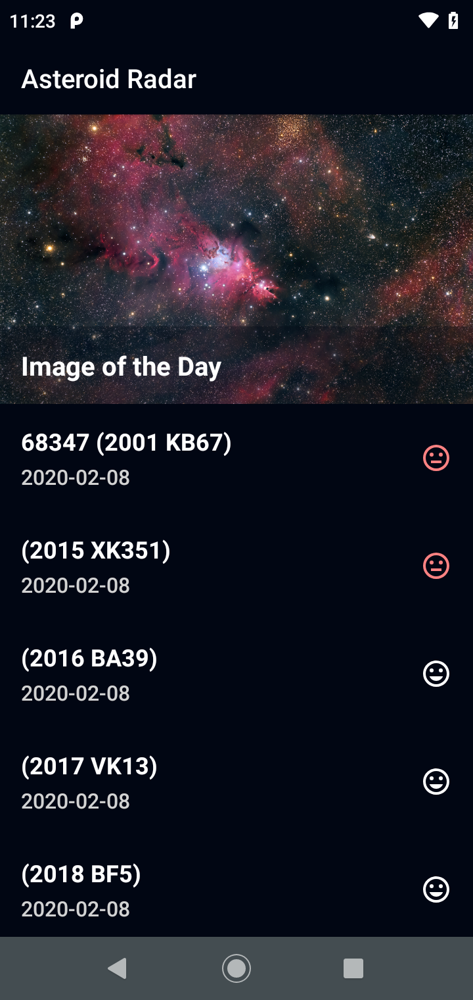

# Project Title

Asteroid Radar

## Getting Started

Asteroid Radar is an app to view the asteroids detected by NASA that pass near Earth, you can view all the detected asteroids in a period of time, their data (Size, velocity, distance to Earth) and if they are potentially hazardous.

The app is consists of two screens: A Main screen with a list of all the detected asteroids and a Details screen that is going to display the data of that asteroid once it´s selected in the Main screen list. The main screen will also show the NASA image of the day to make the app more striking.

This kind of app is one of the most usual in the real world, what you will learn by doing this are some of the most fundamental skills you need to know to work as a professional Android developer, as fetching data from the internet, saving data to a database, and display the data in a clear, clear, compelling UI.

## Screenshots

##Summarized tasks
The application you will build must:

- Include Main screen with a list of clickable asteroids as seen in the provided design using a RecyclerView with its adapter. You could insert some fake manually created asteroids to try this before downloading any data.
- Include a Details screen that displays the selected asteroid data once it’s clicked in the Main screen as seen in the provided design. The images in the details screen are going to be provided with the starter code: an image for a potentially hazardous asteroid and another one for the non-hazardous ones, you have to display the correct image depending on the isPotentiallyHazardous asteroid parameter. Navigation xml file is already included with starter code.
- Download and parse the data from NASA NeoWS (Near Earth Object Web Service) API. As this response cannot be parsed directly with Moshi, we are providing a method to parse the data “manually” for you, it’s called parseAsteroidsJsonResult inside NetworkUtils class, we recommend trying for yourself before using this method or at least take a close look at it as it is an extremely common problem in real-world apps. For this response we need retrofit-converter-scalars instead of Moshi, you can check this dependency in build.gradle (app) file.
- When asteroids are downloaded, save them in the local database.
- Fetch and display the asteroids from the database and only fetch the asteroids from today onwards, ignoring asteroids before today. Also, display the asteroids sorted by date (Check SQLite documentation to get sorted data using a query).
- Be able to cache the data of the asteroid by using a worker, so it downloads and saves today's asteroids in background once a day when the device is charging and wifi is enabled.
- Download Picture of Day JSON, parse it using Moshi and display it at the top of Main screen using Picasso Library. (You can find Picasso documentation here: https://square.github.io/picasso/) You could use Glide if you are more comfortable with it, although be careful as we found some problems displaying NASA images with Glide.
- Add content description to the views: Picture of the day (Use the title dynamically for this), details images and dialog button. Check if it works correctly with talk back.
- Make sure the entire app works without an internet connection.
